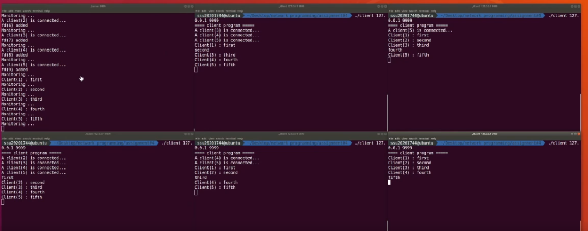

# C - Socket Chatting


## 설명

C언어를 이용한 Linux 기반 Chatting App


## 사용 기술

C, Epoll

환경 : Ubuntu 18.0.4


## 동작 사진




## 사용법

#### compile

```ps
gcc server.c -o server
gcc client.c -o client

```

#### exec

```pseudocode
./server [port_number]
./client [server_ip_address] [port_number]
```


